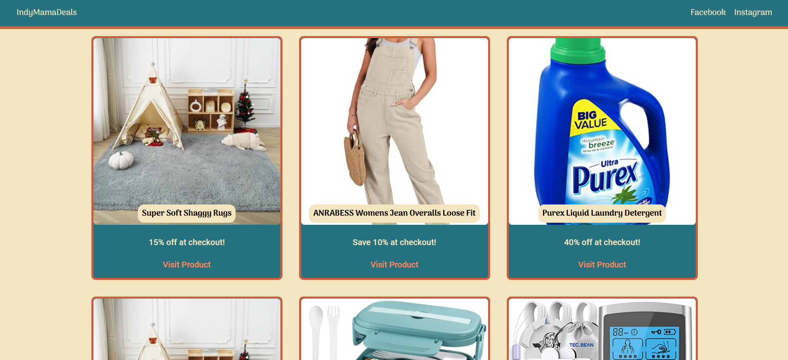

# Amazon Affiliate Website!

IndyMamaDeals is a personal Amazon affiliate website designed for showcasing and advertising handpicked products. The platform leverages the PAAPI5 Amazon API to retrieve detailed product information using an ASIN (Amazon Serial Number) extracted from affiliate links.

In addition to Amazon products, the site also supports promoting items from other affiliate programs, allowing for a diverse range of products to be displayed. As this is a personal project tailored for a specific user, there is no login or signup functionality on the production site, ensuring simplicity and ease of use.

The website is built using Python Flask for the backend and Vue.js for the frontend, creating a seamless and responsive experience for both desktop and mobile users.

# Technologies Used

### Frontend

### Backend

### APIs

### Deployment

